# EventTickets - Microservices Platform

A modern event ticketing platform built with microservices architecture, featuring distributed services, asynchronous messaging, and comprehensive testing tools. Built with **Spring Boot**, **Laravel**, **Node.js**, **React**, **MySQL**, **RabbitMQ**, all containerized with **Docker**.


## 🏗️ Architecture

| Service                         | Technology           | Port | Description                   | Testing/Quality Tools                                          |
| ------------------------------- | -------------------- | ---- | ----------------------------- | -------------------------------------------------------------- |
| `api-gateway`                   | Node.js, Express     | 3000 | Entry point, JWT, routing     | Nodemon, Morgan                                                |
| `EventCatalogService`           | Java 17, Spring Boot | 8080 | Event catalog                 | JUnit, Mockito, JaCoCo, Checkstyle, Snyk, Swagger              |
| `TicketInventoryService`        | Java 17, Spring Boot | 8082 | Stock and reservations        | JUnit, Mockito, JaCoCo, Checkstyle, SonarQube, JMeter, Swagger |
| `paymentAndNotificationService` | PHP 8.2, Laravel     | 8083 | Payments and notifications    | PHPUnit, Mockery, PHPStan, Larastan, Laravel Pint              |
| `user-service`                  | Node.js, Prisma      | 3001 | Authentication, user profiles | Jest, ESLint, Snyk, SonarScanner, Swagger                      |
| `web`                           | React.js, Vite       | 5173 | Frontend                      | ESLint, Vite                                                   |

## 🚀 Quick Start

```bash
# API Gateway (start first)
cd api-gateway && npm install && npm run dev

# Event Catalog Service
cd EventCatalogService && mvnw.cmd spring-boot:run

# Ticket Inventory Service
cd TicketInventoryService && mvnw.cmd spring-boot:run

# Payment & Notification Service
cd paymentAndNotificationService && composer install && php artisan serve

# User Service
cd user-service && npm install && npm run dev

# Frontend
cd web && npm install && npm run dev
```

## 🧪 Tests

| Service                       | Command            |
| ----------------------------- | ------------------ |
| EventCatalogService           | `mvnw.cmd test`    |
| TicketInventoryService        | `mvnw.cmd test`    |
| paymentAndNotificationService | `php artisan test` |

### Code Coverage (JaCoCo)

```bash
cd TicketInventoryService
mvn verify
# Report: target/site/jacoco/index.html
```

### SonarQube Analysis

```bash
cd TicketInventoryService
mvn verify sonar:sonar -Psonar -Dsonar.token=YOUR_TOKEN
```

### Load Testing (JMeter)

```bash
cd TicketInventoryService/jmeter
jmeter -n -t TicketReservationLoadTest.jmx -l results.jtl
```

## 🐳 Docker

```bash
docker-compose up -d
```

## 📁 Project Structure

```
EventTickets/
├── api-gateway/                 # API Gateway (Node.js)
├── EventCatalogService/         # Event Catalog (Spring Boot)
├── TicketInventoryService/      # Inventory (Spring Boot)
├── paymentAndNotificationService/  # Payment (Laravel)
├── user-service/                # Users (Node.js)
├── web/                         # Frontend (React.js)
└── docker-compose.yml
```

## ⚙️ Configuration

Each service requires a `.env` file (see `.env.example` in each folder).

| Service      | Key Variables                  |
| ------------ | ------------------------------ |
| api-gateway  | `JWT_SECRET`, service URLs     |
| Spring Boot  | `spring.datasource.*`          |
| Laravel      | `DB_*`, `MAIL_*`, payment keys |
| user-service | `DATABASE_URL`, `JWT_SECRET`   |
| web          | `VITE_API_BASE_URL`            |

## 📚 API Documentation

- **Swagger UI**: http://localhost:8080/swagger-ui.html (EventCatalog)
- **Swagger UI**: http://localhost:8082/swagger-ui.html (TicketInventory)
- **Swagger UI**: http://localhost:3001/api-docs (User Service)

## 📸 Screenshots

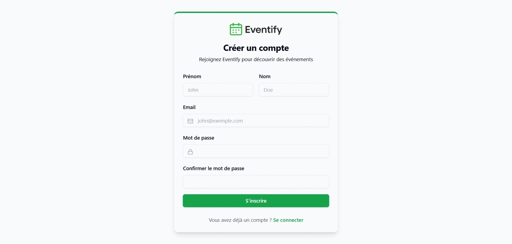
Sign up Page

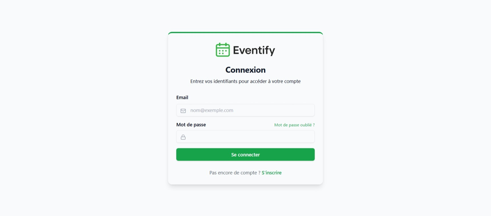
Login Page

### Organizer Side

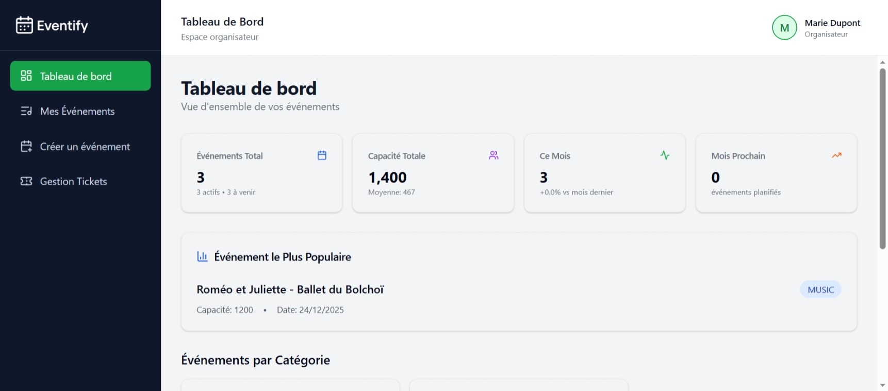
Dashboard organizer

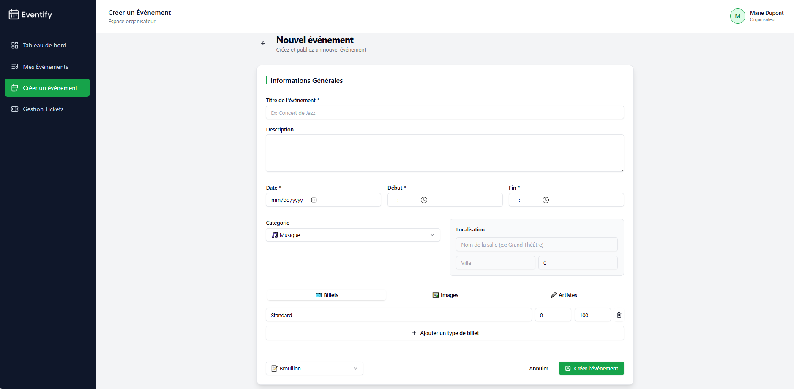
Add New Event Page

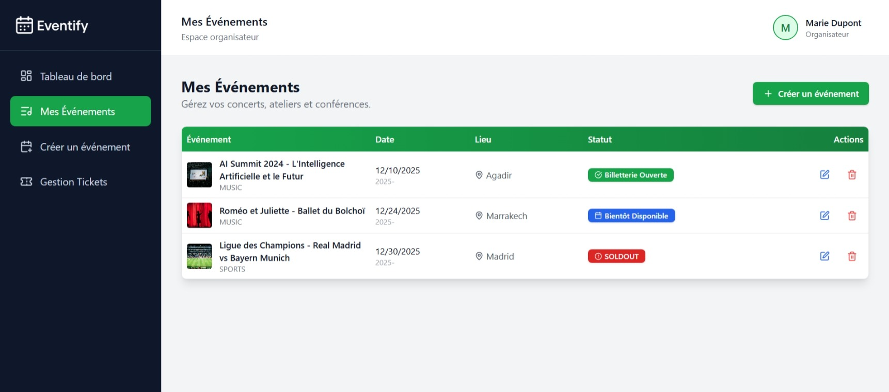
My Events Page

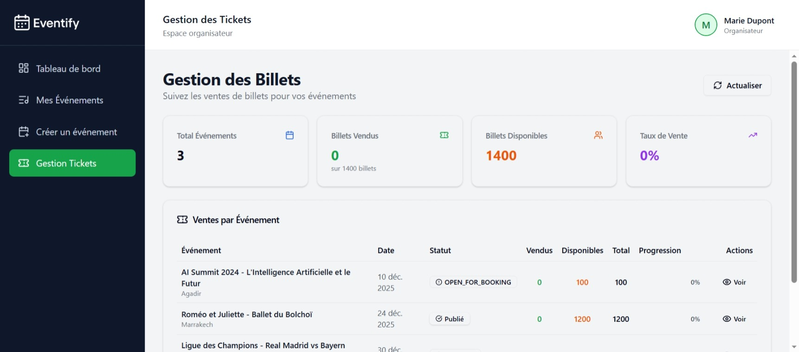
Tickets Management

### Client Side


Home Page

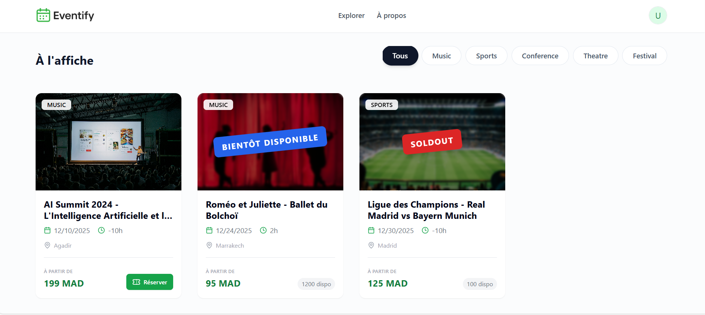
Events page

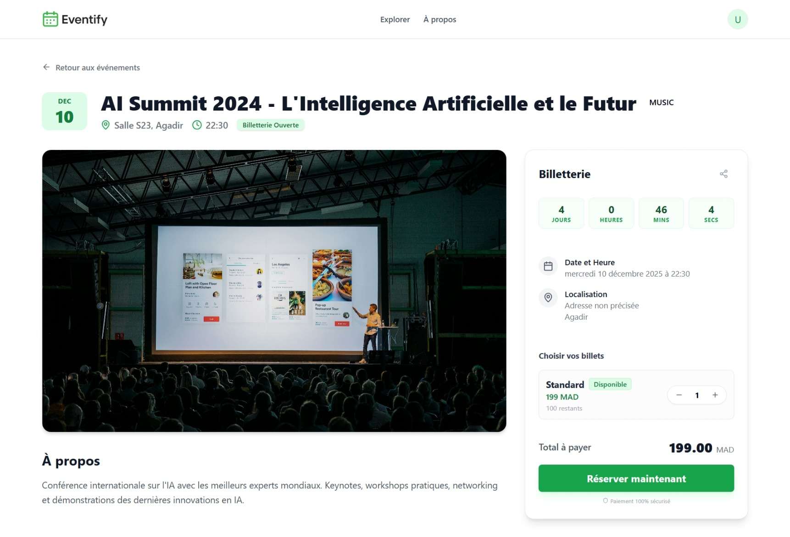
Event Detail Page

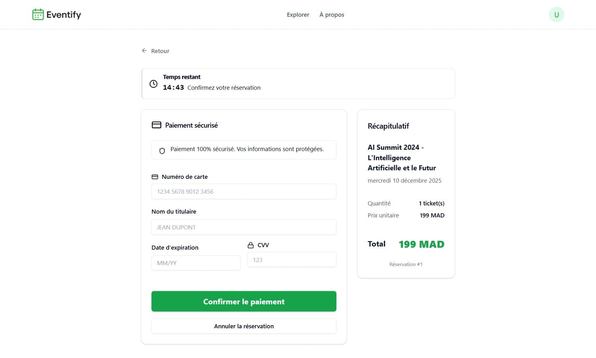
Event Reservation Page

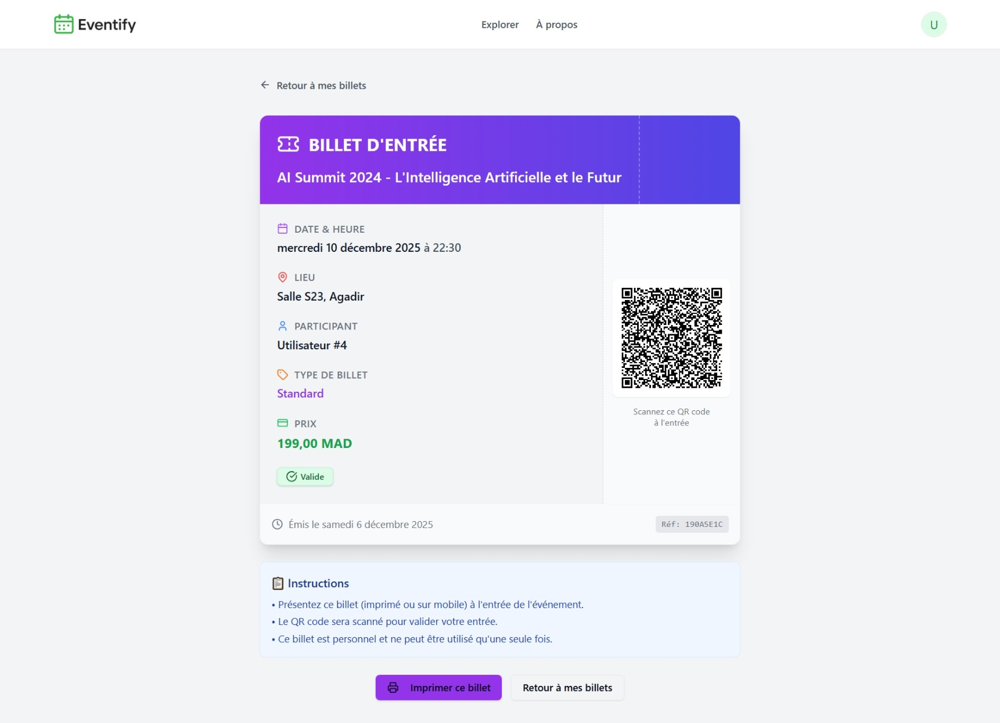
Ticket Detail

### Admin Panel

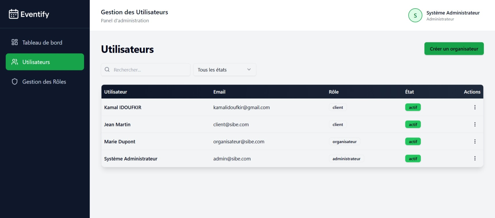
Admin Dashboard for Users Management

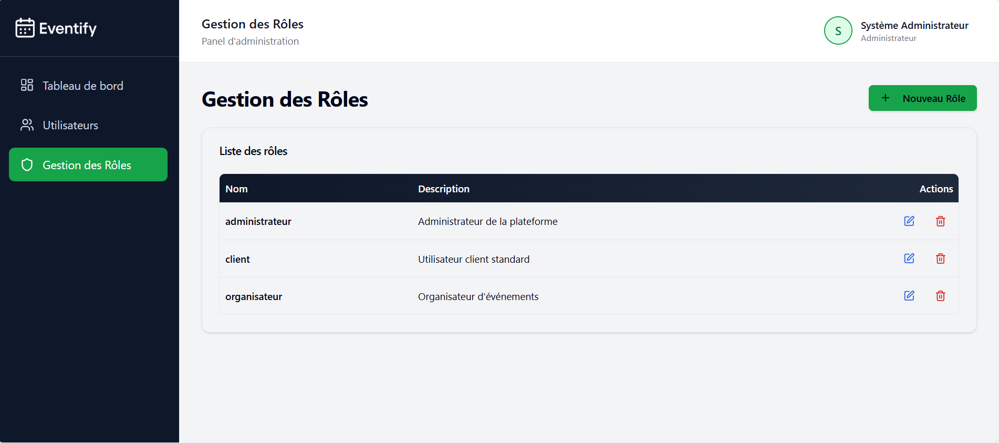
Admin Dashboard for Roles Management
